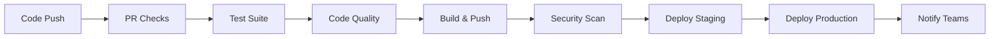

# CI/CD Pipeline Documentation

This document describes the comprehensive CI/CD pipeline implementation for the Store Application.

## Overview

The CI/CD pipeline provides automated testing, building, security scanning, and deployment of the Store Application as a containerized solution. It supports multiple environments and includes comprehensive monitoring and observability features.

## Pipeline Architecture



## Components

### 1. GitHub Actions Workflows

#### Main CI/CD Pipeline (`.github/workflows/ci-cd.yml`)
- **Triggers**: Push to `main`, `develop`, `feature/*` branches
- **Jobs**:
  - `test`: Unit and integration tests with PostgreSQL/Redis services
  - `code-quality`: Formatting checks and SonarQube analysis
  - `build-and-push`: Docker image build and push to GitHub Container Registry
  - `security-scan`: Trivy vulnerability scanning
  - `deploy-staging`: Deploy to staging environment (develop branch)
  - `deploy-production`: Deploy to production environment (main branch)
  - `notify`: Team notifications

#### Pull Request Checks (`.github/workflows/pr-checks.yml`)
- **Triggers**: PR opened, synchronized, reopened
- **Validations**:
  - Code formatting (Spotless)
  - Compilation verification
  - Test execution
  - Coverage verification
  - Docker image build validation
  - Automated PR comments with results

### 2. Docker Configuration

#### Dockerfile
- **Multi-stage build** for optimized image size
- **Security**: Non-root user execution
- **Health checks** for container monitoring
- **JVM optimization** for containerized environments
- **Base image**: Eclipse Temurin OpenJDK 17 Alpine

#### Docker Compose (`docker-compose.yml`)
Complete development/production environment:
- **Store Application**: Main Spring Boot service
- **PostgreSQL**: Database with persistent volumes
- **Redis**: Cache layer with persistence
- **Prometheus**: Metrics collection
- **Grafana**: Monitoring dashboards

### 3. Build Scripts

#### `build-docker.sh`
Comprehensive build script with options:
- Test execution
- Docker image building
- Registry pushing
- Service orchestration
- Clean builds

## Setup Instructions

### Prerequisites
- Docker and Docker Compose
- JDK 17
- Git

### GitHub Repository Setup

1. **Enable GitHub Packages**:
   - Go to repository Settings → Packages
   - Enable package creation

2. **Configure Secrets** (if using SonarQube):
   ```
   SONAR_TOKEN: Your SonarQube token
   ```

3. **Environment Protection Rules**:
   - `staging`: Require PR reviews
   - `production`: Require manual approval

### Local Development

1. **Clone and build**:
   ```bash
   git clone <repository-url>
   cd store
   ./build-docker.sh
   ```

2. **Access services**:
   - Store API: http://localhost:8081
   - Prometheus: http://localhost:9090
   - Grafana: http://localhost:3000 (admin/admin123)

## Pipeline Features

### Testing Strategy
- **Unit Tests**: JUnit 5 with comprehensive coverage
- **Integration Tests**: TestContainers with PostgreSQL/Redis
- **Coverage Reports**: JaCoCo with Codecov integration
- **Test Results**: Published to GitHub with detailed reports

### Code Quality
- **Formatting**: Spotless with Palantir Java format
- **Analysis**: SonarQube integration (optional)
- **Validation**: Gradle wrapper validation
- **PR Automation**: Automated status comments

### Security
- **Container Scanning**: Trivy vulnerability analysis
- **SARIF Reports**: GitHub Security tab integration
- **Base Image**: Minimal Alpine Linux
- **Non-root Execution**: Enhanced container security

### Monitoring & Observability
- **Metrics**: Spring Boot Actuator + Micrometer
- **Prometheus**: Metrics collection and alerting
- **Grafana**: Visual dashboards and monitoring
- **Health Checks**: Application and infrastructure
- **Logging**: Structured logging with configurable levels

### Deployment Strategy
- **Multi-environment**: Staging and Production
- **Image Tagging**: Semantic versioning with Git SHA
- **Rollback Support**: Tagged images for quick rollback
- **Zero-downtime**: Health check-based deployments

## Usage Examples

### Building and Testing
```bash
# Full build with tests
./build-docker.sh

# Build only (skip tests)
./build-docker.sh --build-only --no-tests

# Build with custom tag
./build-docker.sh --tag v1.0.0

# Build and push to registry
./build-docker.sh --registry ghcr.io/username --push
```

### Development Commands
```bash
# Start all services
docker-compose up -d

# View logs
docker-compose logs -f store-app

# Scale application
docker-compose up -d --scale store-app=3

# Check health
curl http://localhost:8081/actuator/health
```

### CI/CD Commands
```bash
# Validate Gradle wrapper
gradle wrapper --validate

# Run code formatting check
./gradlew spotlessCheck

# Apply code formatting
./gradlew spotlessApply

# Generate coverage report
./gradlew jacocoTestReport
```

## Environment Variables

### Application Configuration
```bash
SPRING_PROFILES_ACTIVE=docker
SPRING_DATASOURCE_URL=jdbc:postgresql://postgres:5432/store_db
SPRING_DATASOURCE_USERNAME=store_user
SPRING_DATASOURCE_PASSWORD=store_password
SPRING_DATA_REDIS_HOST=redis
SPRING_DATA_REDIS_PORT=6379
```

### CI/CD Configuration
```bash
GITHUB_TOKEN=<automatic>
SONAR_TOKEN=<optional>
REGISTRY=ghcr.io
IMAGE_NAME=store-app
```

## Monitoring and Alerts

### Health Checks
- Application: `/actuator/health`
- Database: PostgreSQL connection
- Cache: Redis ping
- Container: Docker health check

### Metrics Available
- JVM metrics (memory, GC, threads)
- HTTP request metrics
- Database connection pool
- Cache hit/miss rates
- Custom business metrics

### Grafana Dashboards
- Application Overview
- JVM Performance
- Database Metrics
- HTTP Request Analytics
- Error Rate Monitoring

## Troubleshooting

### Common Issues

1. **Build Failures**:
   ```bash
   # Clean and rebuild
   ./gradlew clean build
   docker system prune -f
   ```

2. **Database Connection**:
   ```bash
   # Check database status
   docker-compose ps postgres
   docker-compose logs postgres
   ```

3. **Memory Issues**:
   ```bash
   # Adjust JVM settings
   export JAVA_OPTS="-Xmx1g -Xms512m"
   ```

### Log Analysis
```bash
# Application logs
docker-compose logs -f store-app

# Database logs
docker-compose logs -f postgres

# All services
docker-compose logs -f
```

## Security Considerations

1. **Container Security**:
   - Non-root user execution
   - Minimal base image
   - Regular security scanning

2. **Secrets Management**:
   - GitHub Secrets for tokens
   - Environment variable injection
   - No hardcoded credentials

3. **Network Security**:
   - Internal Docker networks
   - Exposed ports only as needed
   - Health check endpoints

## Maintenance

### Regular Tasks
- Update base images monthly
- Review security scan results
- Monitor resource usage
- Update dependencies quarterly

### Backup Strategy
- Database: Automated PostgreSQL backups
- Configuration: Version controlled
- Monitoring: Prometheus retention policies

This CI/CD pipeline provides a robust, scalable, and secure foundation for the Store Application deployment lifecycle.