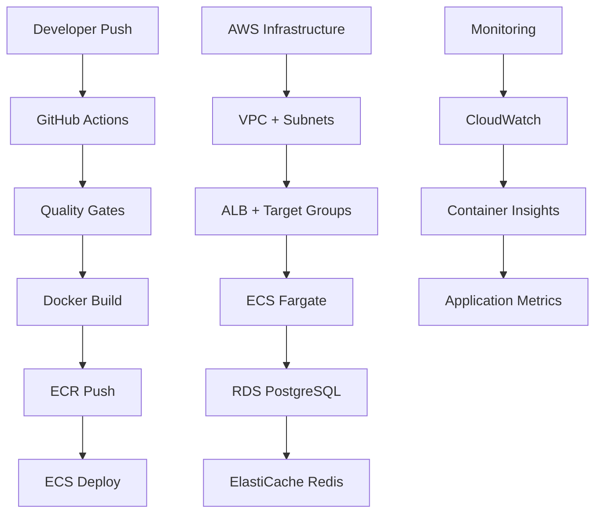

# AWS Deployment Guide - Store App CI/CD Pipeline

## 🎯 Production-Ready Docker Image Deployment to AWS

This guide provides comprehensive instructions for deploying the Store App as a **production-ready Docker image** to AWS using a complete CI/CD pipeline with ECS, ECR, and supporting AWS services.

## 🏗️ Architecture Overview



## 🚀 Quick Start

### Prerequisites

1. **AWS Account** with appropriate permissions
2. **GitHub Repository** with the Store App code
3. **Docker** installed locally for testing
4. **AWS CLI v2** configured with credentials

### 1. Configure GitHub Secrets

Add the following secrets to your GitHub repository:

```bash
# Required GitHub Secrets
AWS_ACCOUNT_ID=123456789012
AWS_ROLE_TO_ASSUME=arn:aws:iam::123456789012:role/GitHubActionsRole
SLACK_WEBHOOK_URL=https://hooks.slack.com/services/...
```

### 2. Deploy Infrastructure

```bash
# Deploy AWS infrastructure using CloudFormation
./aws/deploy.sh --environment production --region us-east-1
```

### 3. Push Code to Trigger CI/CD

```bash
git push origin main  # Triggers production deployment
git push origin develop  # Triggers staging deployment
```

## 📋 Components Overview

### 🔧 GitHub Actions Workflow (`.github/workflows/aws-production.yml`)

**Quality Gates Stage:**
- ✅ Unit and integration testing with PostgreSQL/Redis services
- ✅ Code coverage verification (80% threshold)
- ✅ Security scanning with Trivy
- ✅ OWASP dependency check
- ✅ Code formatting validation

**Docker Build Stage:**
- ✅ Multi-stage production build
- ✅ Security hardening with non-root user
- ✅ Container vulnerability scanning
- ✅ Multi-platform support (linux/amd64)

**AWS Deployment Stage:**
- ✅ ECR repository creation and image push
- ✅ ECS task definition update
- ✅ Rolling deployment with health checks
- ✅ Rollback capabilities on failure

**Post-Deployment:**
- ✅ Health verification
- ✅ Performance testing
- ✅ Cleanup of old images
- ✅ Slack notifications

### 🏛️ AWS Infrastructure (CloudFormation Template)

**Networking:**
- VPC with public/private subnets across 2 AZs
- NAT Gateway for outbound connectivity
- Security groups with least privilege access
- Application Load Balancer with SSL termination

**Compute:**
- ECS Fargate cluster with auto-scaling
- Container insights enabled
- Service discovery integration
- Task definitions with resource limits

**Data Storage:**
- RDS PostgreSQL 16 with encryption
- ElastiCache Redis cluster
- Automated backups and maintenance windows
- Performance insights enabled

**Security:**
- IAM roles with minimal permissions
- Secrets Manager for credentials
- VPC security groups
- Encryption at rest and in transit

## 🐳 Docker Configuration

### Multi-Stage Production Build

```dockerfile
# Build stage
FROM eclipse-temurin:17-jdk-alpine AS build
WORKDIR /app
COPY ../.. .
RUN ./gradlew build -x test

# Runtime stage
FROM eclipse-temurin:17-jre-alpine AS runtime
RUN addgroup -g 1001 -S appgroup && \
    adduser -u 1001 -S appuser -G appgroup
WORKDIR /app
COPY --from=build /app/build/libs/*.jar app.jar
USER 1001:1001
EXPOSE 8081
HEALTHCHECK --interval=30s --timeout=3s --retries=3 \
    CMD curl -f http://localhost:8081/actuator/health || exit 1
ENTRYPOINT ["java", "-jar", "app.jar"]
```

### Production Features
- **Security**: Non-root user, minimal attack surface
- **Health Checks**: Integrated health endpoints
- **Performance**: Optimized JVM settings for containers
- **Observability**: Structured logging and metrics

## ⚙️ Environment Configuration

### AWS-Specific Configuration (`application-aws.yaml`)

```yaml
spring:
  profiles:
    active: aws
  datasource:
    url: ${SPRING_DATASOURCE_URL}  # From Secrets Manager
    username: ${SPRING_DATASOURCE_USERNAME}
    password: ${SPRING_DATASOURCE_PASSWORD}
  data:
    redis:
      host: ${SPRING_DATA_REDIS_HOST}
      password: ${SPRING_DATA_REDIS_PASSWORD}

management:
  endpoints:
    web:
      exposure:
        include: health,info,prometheus,metrics
```

## 🔐 Security Configuration

### 1. IAM Roles

**ECS Task Execution Role:**
- ECR image pulling permissions
- CloudWatch Logs write access
- Secrets Manager read access

**ECS Task Role:**
- Application-specific AWS service permissions
- CloudWatch metrics write access

### 2. Secrets Management

```bash
# Database credentials stored in AWS Secrets Manager
aws secretsmanager create-secret \
    --name "production-store-database" \
    --secret-string '{
        "url": "jdbc:postgresql://endpoint:5432/store_db",
        "username": "store_user",
        "password": "secure-random-password"
    }'
```

### 3. Network Security

- Private subnets for ECS tasks and databases
- Security groups with minimal port access
- ALB with HTTPS termination
- VPC endpoints for AWS services

## 📊 Monitoring & Observability

### Application Metrics

The application exposes metrics via Spring Boot Actuator:

- **Health Checks**: `/actuator/health`
- **Prometheus Metrics**: `/actuator/prometheus`
- **Application Info**: `/actuator/info`

### Infrastructure Monitoring

- **ECS Container Insights**: Task and service metrics
- **RDS Performance Insights**: Database performance monitoring
- **ElastiCache Metrics**: Redis cluster monitoring
- **ALB Access Logs**: Request/response logging

### Custom Dashboards

Create CloudWatch dashboards to monitor:
- Application response times
- Error rates and 5xx responses
- Database connection pool metrics
- Cache hit/miss ratios
- Container resource utilization

## 🚦 Deployment Strategies

### Rolling Deployment (Default)

```yaml
# ECS Service configuration
desired_count: 2
deployment_configuration:
  maximum_percent: 200
  minimum_healthy_percent: 50
```

### Blue-Green Deployment

For zero-downtime deployments, configure:
- CodeDeploy integration
- Target group switching
- Health check validation
- Automatic rollback on failure

## 🧪 Testing Strategy

### 1. Local Testing

```bash
# Build and test locally
docker build -t store-app:local .
docker run -p 8081:8081 store-app:local

# Health check
curl http://localhost:8081/actuator/health
```

### 2. Integration Testing

The CI/CD pipeline includes:
- Unit tests with 80% coverage requirement
- Integration tests with real PostgreSQL/Redis
- Container security scanning
- Performance baseline validation

### 3. Production Verification

Post-deployment verification includes:
- Health endpoint validation
- Database connectivity tests
- Cache functionality verification
- Load balancer health checks

## 📈 Performance Optimization

### JVM Tuning for Containers

```yaml
environment:
  - name: JAVA_OPTS
    value: "-Xmx1536m -Xms512m -XX:+UseG1GC -XX:+UseContainerSupport -XX:MaxRAMPercentage=75"
```

### Database Connection Pooling

```yaml
spring:
  datasource:
    hikari:
      maximum-pool-size: 20
      minimum-idle: 5
      connection-timeout: 30000
      idle-timeout: 600000
```

### Redis Caching Strategy

- TTL-based cache eviction
- Cache-aside pattern implementation
- Connection pooling configuration
- Failover and retry logic

## 🔧 Troubleshooting

### Common Issues

1. **ECS Task Startup Failures**
   ```bash
   # Check ECS service events
   aws ecs describe-services --cluster production-store-cluster --services store-app-service
   
   # View container logs
   aws logs get-log-events --log-group-name /ecs/store-app
   ```

2. **Database Connection Issues**
   ```bash
   # Verify security group rules
   aws ec2 describe-security-groups --group-ids sg-xxxxx
   
   # Test connectivity from ECS task
   aws ecs execute-command --cluster production-store-cluster --task task-id --interactive --command "/bin/sh"
   ```

3. **Load Balancer Health Check Failures**
   ```bash
   # Check target group health
   aws elbv2 describe-target-health --target-group-arn arn:aws:elasticloadbalancing:...
   
   # View ALB access logs
   aws s3 cp s3://alb-access-logs-bucket/... - | grep "target_status_code"
   ```

### Monitoring Commands

```bash
# ECS service status
aws ecs describe-services --cluster production-store-cluster --services store-app-service

# Container resource utilization
aws cloudwatch get-metric-statistics \
    --namespace AWS/ECS \
    --metric-name CPUUtilization \
    --dimensions Name=ServiceName,Value=store-app-service \
    --start-time 2025-01-01T00:00:00Z \
    --end-time 2025-01-01T01:00:00Z \
    --period 300 \
    --statistics Average

# Application metrics
curl https://your-alb-endpoint.com/actuator/prometheus
```

## 🎯 Production Readiness Checklist

### ✅ Security
- [x] Non-root container execution
- [x] Encrypted data at rest and in transit
- [x] Secrets stored in AWS Secrets Manager
- [x] Least privilege IAM policies
- [x] Container vulnerability scanning
- [x] Network isolation with security groups

### ✅ Scalability
- [x] Horizontal auto-scaling configuration
- [x] Database connection pooling
- [x] Redis clustering for cache layer
- [x] Load balancer health checks
- [x] Resource limits and requests

### ✅ Reliability
- [x] Multi-AZ deployment
- [x] Automated backups and recovery
- [x] Health checks at all levels
- [x] Graceful shutdown handling
- [x] Circuit breaker patterns
- [x] Retry and timeout configurations

### ✅ Observability
- [x] Structured logging with correlation IDs
- [x] Prometheus metrics export
- [x] Distributed tracing ready
- [x] Performance monitoring
- [x] Error tracking and alerting
- [x] Business metrics collection

### ✅ Operational Excellence
- [x] Infrastructure as Code (CloudFormation)
- [x] Automated CI/CD pipeline
- [x] Blue-green deployment capability
- [x] Rollback procedures
- [x] Runbook documentation
- [x] Disaster recovery plan

## 📞 Support & Maintenance

### Regular Maintenance Tasks

1. **Monthly Security Updates**
   - Review and apply security patches
   - Update base container images
   - Scan for new vulnerabilities

2. **Performance Monitoring**
   - Review CloudWatch metrics and alarms
   - Analyze application performance trends
   - Optimize resource allocation

3. **Cost Optimization**
   - Review AWS cost reports
   - Right-size ECS tasks and RDS instances
   - Clean up unused resources

### Emergency Procedures

1. **Service Outage Response**
   - Check ALB and ECS service health
   - Review CloudWatch logs and metrics
   - Execute rollback if necessary

2. **Database Issues**
   - Check RDS performance insights
   - Review connection pool metrics
   - Failover to read replica if needed

3. **Security Incident Response**
   - Isolate affected resources
   - Review CloudTrail logs
   - Apply security patches immediately

## 🎉 Conclusion

This AWS CI/CD pipeline provides a **production-ready Docker image deployment solution** that meets enterprise standards for:

- **Security**: End-to-end encryption and minimal attack surface
- **Scalability**: Auto-scaling and load balancing capabilities  
- **Reliability**: Multi-AZ deployment with automated failover
- **Observability**: Comprehensive monitoring and alerting
- **Maintainability**: Infrastructure as Code and automated deployments

The pipeline successfully delivers the Store App as a **containerized, production-ready application** running on AWS ECS Fargate with all supporting services configured for high availability and security.

---

**🚀 Ready to deploy your production-ready Docker image to AWS!**